---

## **1. BUSINESS REQUIREMENTS & STRATEGIC OBJECTIVES**

### **Executive Summary**
GlobalMart Inc., a $5B multinational retailer with 500+ stores globally, is facing digital transformation challenges. Legacy systems are impeding growth, increasing security risks, and limiting data-driven decision making.

### **Core Business Challenges**
- **$2.3M** annual infrastructure maintenance costs
- **48-hour** delay in sales reporting impacting inventory decisions
- **15%** cart abandonment rate due to poor personalization
- **SOX & GDPR** compliance gaps in data handling
- **Inability** to scale during holiday seasons (30% revenue concentration)

### **Strategic Objectives**
1. **Real-time Analytics**: Reduce reporting latency from 48 hours to <5 minutes
2. **Customer 360**: Increase personalized engagement by 40% in 12 months
3. **Cost Optimization**: Reduce infrastructure spend by 35% while improving performance
4. **Security & Compliance**: Achieve SOC2, GDPR, and PCI-DSS compliance
5. **Scalability**: Support 200% traffic growth during holiday seasons

### **Success Metrics**
| KPI | Current | Target | Timeline |
|-----|---------|--------|----------|
| Reporting Latency | 48 hours | <5 minutes | 6 months |
| Infrastructure Cost | $2.3M/year | $1.5M/year | 12 months |
| Personalization Rate | 5% | 45% | 12 months |
| System Availability | 99.0% | 99.9% | 6 months |

---

## **2. ARCHITECTURAL DIAGRAM**

```mermaid
graph TB
    %% External Systems
    subgraph External Systems
        POS[Point-of-Sale Systems]
        EC[E-commerce Platform]
        SUP[Supply Chain Systems]
        ONPREM[On-premise Data Center]
    end

    %% Ingestion Layer
    subgraph A [Data Ingestion Layer]
        PUBSUB[Cloud Pub/Sub<br/>Real-time Event Streaming]
        PSC[Private Service Connect<br/>Secure API Access]
    end

    %% Processing Layer
    subgraph B [Stream Processing & Security]
        subgraph B1 [Dataflow Streaming]
            DF1[Dataflow Job 1<br/>Data Enrichment]
            DF2[Dataflow Job 2<br/>DLP Processing]
            DF3[Dataflow Job 3<br/>Real-time Aggregation]
        end
        
        subgraph B2 [Security & Governance]
            DLP[Cloud DLP<br/>Sensitive Data Classification]
            SEC[Secret Manager<br/>Credentials Management]
            KMS[Cloud KMS<br/>Encryption Keys]
        end
    end

    %% Storage Layer
    subgraph C [Storage & Databases]
        subgraph C1 [Operational Data]
            FIRESTORE[Cloud Firestore<br/>Product Catalog & Cart]
            CLOUDSQL[Cloud SQL PostgreSQL<br/>User Profiles]
            SPANNER[Cloud Spanner<br/>Inventory Management]
        end
        
        subgraph C2 [Data Warehouse]
            BQ[BigQuery<br/>Enterprise Data Warehouse]
            BQDS[BigQuery Datasets<br/>Partitioned & Clustered]
        end
        
        subgraph C3 [Data Lake]
            GCS[Cloud Storage<br/>Raw Data Lake]
            GCS_BUCKETS[Versioned Buckets<br/>Retention Policies]
        end
    end

    %% Analytics & AI/ML
    subgraph D [Analytics & Machine Learning]
        BQML[BigQuery ML<br/>Recommendation Models]
        VAI[Vertex AI<br/>Demand Forecasting]
        LOOKER[Looker Studio<br/>Business Dashboards]
    end

    %% Infrastructure & Orchestration
    subgraph E [Infrastructure & Orchestration]
        subgraph E1 [Kubernetes Platform]
            GKE[GKE Regional Cluster<br/>Auto-scaling Node Pools]
            ASM[Anthos Service Mesh<br/>Traffic Management]
        end
        
        COMPOSER[Cloud Composer<br/>Workflow Orchestration]
        LB[Global Load Balancer<br/>Cloud Armor Protected]
    end

    %% Security & Governance
    subgraph F [Security & Governance Perimeter]
        VPCSC[VPC Service Controls<br/>Data Exfiltration Protection]
        IAP[Identity-Aware Proxy<br/>Zero-Trust Access]
        SCC[Security Command Center<br/>Compliance Monitoring]
    end

    %% Observability & Operations
    subgraph G [Observability & FinOps]
        subgraph G1 [Monitoring]
            MON[Cloud Monitoring<br/>SLO Tracking & Alerting]
            LOG[Cloud Logging<br/>Centralized Log Analysis]
            TRACE[Cloud Trace<br/>Performance Profiling]
        end
        
        subgraph G2 [Cost Management]
            BILLING[Billing Export<br/>Cost Allocation]
            REC[Recommender API<br/>Resource Optimization]
            FINOPS[FinOps Dashboard<br/>Cost Visibility]
        end
    end

    %% Data Flow Connections
    POS --> PUBSUB
    EC --> PUBSUB
    SUP --> PUBSUB
    ONPREM --> PSC
    
    PUBSUB --> DF1
    PSC --> DF1
    
    DF1 --> DLP
    DLP --> DF2
    DF2 --> DF3
    
    DF3 --> BQ
    DF3 --> GCS
    DF3 --> FIRESTORE
    
    BQ --> BQML
    BQ --> LOOKER
    BQ --> VAI
    
    GCS --> BQ
    FIRESTORE --> GKE
    CLOUDSQL --> GKE
    SPANNER --> GKE
    
    COMPOSER --> BQ
    COMPOSER --> GCS
    COMPOSER --> VAI
    
    LB --> GKE
    GKE --> ASM
    
    %% Security Connections
    VPCSC -.->|Perimeter| B
    VPCSC -.->|Perimeter| C
    VPCSC -.->|Perimeter| D
    
    IAP -.->|Access| GKE
    SCC -.->|Monitoring| ALL[All Components]
    
    %% Observability Connections
    MON -.->|Metrics| ALL
    LOG -.->|Logs| ALL
    TRACE -.->|Traces| ALL
    
    BILLING --> FINOPS
    REC --> FINOPS

    classDef external fill:#e1f5fe
    classDef ingestion fill:#f3e5f5
    classDef processing fill:#e8f5e8
    classDef storage fill:#fff3e0
    classDef analytics fill:#fce4ec
    classDef infrastructure fill:#e0f2f1
    classDef security fill:#ffebee
    classDef observability fill:#f1f8e9
    
    class POS,EC,SUP,ONPREM external
    class PUBSUB,PSC ingestion
    class DF1,DF2,DF3,DLP,SEC,KMS processing
    class FIRESTORE,CLOUDSQL,SPANNER,BQ,GCS storage
    class BQML,VAI,LOOKER analytics
    class GKE,ASM,COMPOSER,LB infrastructure
    class VPCSC,IAP,SCC security
    class MON,LOG,TRACE,BILLING,REC,FINOPS observability
```

---

## **3. CORPORATE TRAINING MODULES**

### **Module 1: GCP Foundations & Architecture (Week 1-2)**
**Hands-on Lab: Design GlobalMart's Resource Hierarchy**
- Create Organization, Folders (prod/dev/staging), and Projects
- Configure centralized billing with cost allocation tags
- Implement IAM boundaries using groups and service accounts
- Set up Hybrid Connectivity via Cloud VPN to simulate on-premise

### **Module 2: Clustering & High Availability (Week 3-4)**
**Hands-on Lab: Build GlobalMart's GKE Platform**
- Deploy regional GKE cluster with auto-scaling node pools
- Configure HTTP Load Balancer with Cloud Armor
- Implement Anthos Service Mesh for traffic management
- Automate deployment using Cloud Build + Terraform

### **Module 3: Security & Network Protection (Week 5-6)**
**Hands-on Lab: Implement Zero-Trust Security**
- Configure VPC-SC perimeter for data protection
- Set up IAP for secure internal access
- Implement Cloud DLP for sensitive data classification
- Deploy Cloud IDS for threat detection

### **Module 4: Data Storage & Governance (Week 7-8)**
**Hands-on Lab: Design Data Governance Framework**
- Create partitioned BigQuery tables with clustering
- Implement Policy Tags for column-level security
- Set up Data Catalog for metadata management
- Configure Data Loss Prevention policies

### **Module 5: Data Processing Pipelines (Week 9-10)**
**Hands-on Lab: Build Real-time Retail Pipeline**
- Create Pub/Sub topics for event streaming
- Develop Dataflow pipeline with DLP integration
- Implement exactly-once processing with error handling
- Orchestrate workflows using Cloud Composer

### **Module 6: Advanced Analytics & ML (Week 11-12)**
**Hands-on Lab: Implement Retail Analytics & ML**
- Build BigQuery ML recommendation model
- Create real-time dashboards in Looker Studio
- Develop demand forecasting with Vertex AI
- Optimize query performance and costs

### **Module 7: Observability & SRE (Week 13-14)**
**Hands-on Lab: Implement Production Monitoring**
- Create SLO-based alerting in Cloud Monitoring
- Build FinOps dashboards for cost visibility
- Implement distributed tracing with Cloud Trace
- Set up error budget tracking

### **Module 8: FinOps & Cost Governance (Week 15-16)**
**Hands-on Lab: Optimize GlobalMart's Cloud Spend**
- Analyze billing data in BigQuery
- Implement Recommender API automation
- Set up budget alerts and cost anomaly detection
- Create commitment-based discount strategy

### **Module 9: Data Governance & Compliance (Week 17-18)**
**Hands-on Lab: Enterprise Compliance Framework**
- Implement data lineage tracking
- Set up automated compliance scanning
- Configure audit trails for regulatory requirements
- Build compliance dashboards

### **Module 10: Capstone Project (Week 19-20)**
**Final Assessment: End-to-End Platform Implementation**
Teams of 4-5 participants will:
1. Design and deploy the complete architecture
2. Implement security controls and governance
3. Load and process sample retail datasets
4. Build real-time dashboards and ML models
5. Present cost optimization and performance results

---

